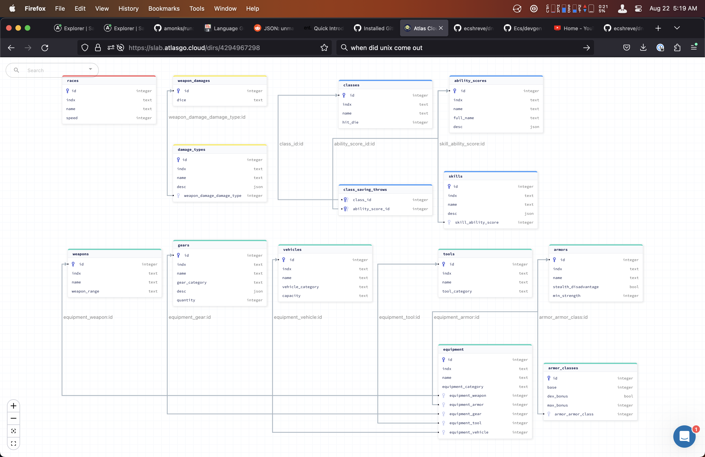
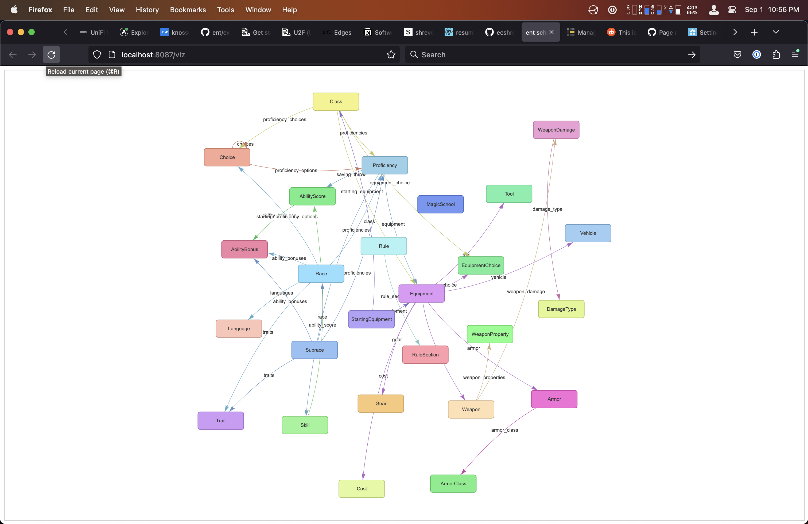
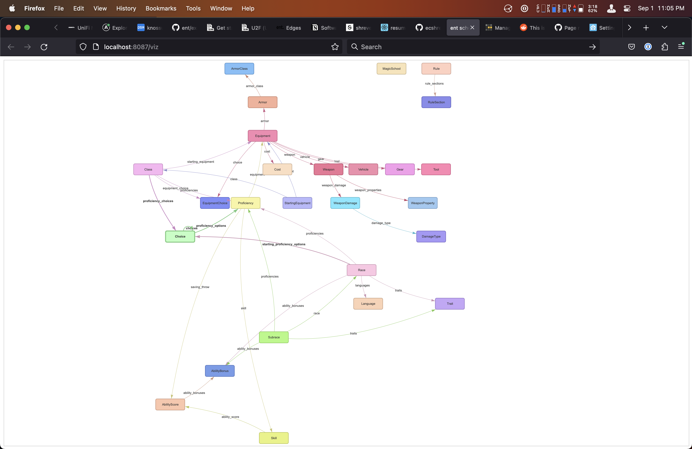
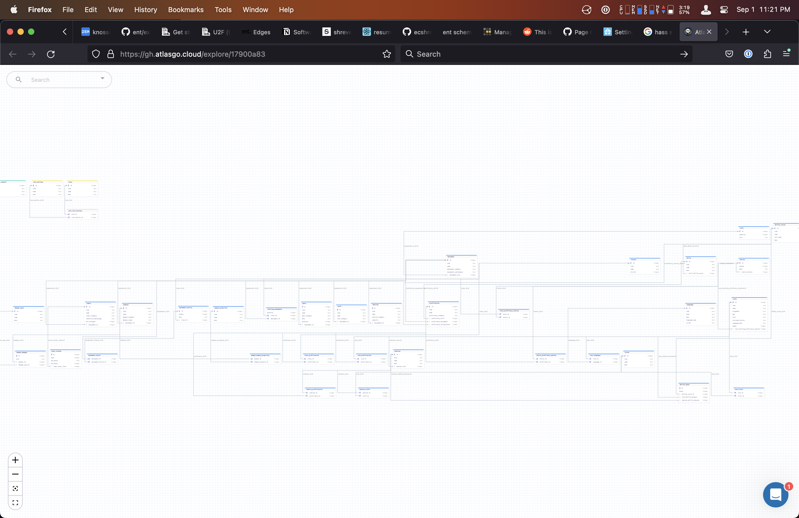
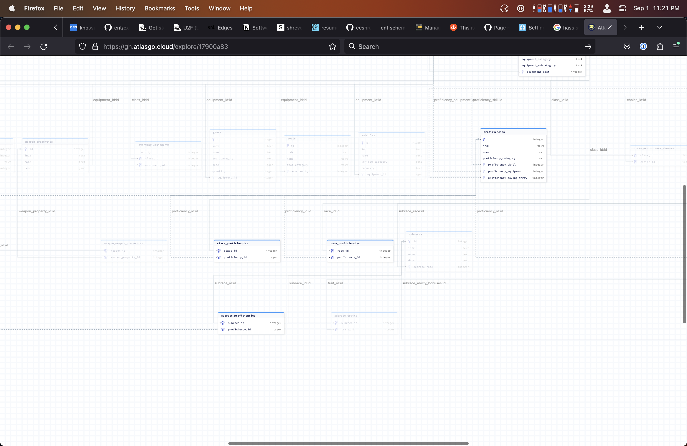

# dndgen

Define general DnD rules and gameplay as an [ent](https://entgo.io/docs/getting-started) schema, then do fun stuff with it.

## usage

### dependencies

```
go install github.com/amonks/run/cmd/run@v1.0.0-beta.30
go get github.com/99designs/gqlgen@v0.17.30
go get github.com/hedwigz/entviz
```


Execute `run dev` to generate the schema, gqlgen files, and start the server.

## schema visualization screenshots

<hr>

<hr>

<hr>

<hr>


## data

Data is seeded from the same JSON files that back the [5e-srd-api](https://github.com/5e-bits/5e-srd-api). (with some small adjustments here and there) 


